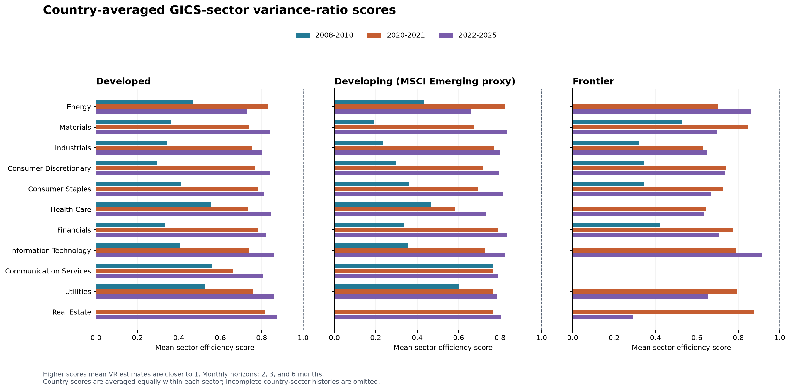

# Global Market Efficiency by Sector

## What was compared

The analysis groups country GICS industry portfolios into Developed, Developing (the source's MSCI Emerging category), and Frontier. It uses every market in the intersection of the JKP classification file and available GICS files: 23 developed, 23 emerging, and 18 frontier markets. A country-sector-period observation is included only when every monthly return in that period exists and the portfolio has at least one stock. No missing returns are filled.

For well-known national broad-market benchmarks, this report includes representative equivalents: S&P 500 (United States), S&P/TSX Composite (Canada), TOPIX (Japan), NIFTY 50 (India), Ibovespa (Brazil), FTSE/JSE All Share (South Africa), VN-Index (Vietnam), KSE-100 (Pakistan), and MASI (Morocco). These index names help orient the country comparison; the calculated sector scores use the JKP country-sector return portfolios, not those named headline index price series.

The JKP source provides GICS industry returns for all countries, but these industry files are monthly. They are value-weighted sector portfolios, not daily headline benchmark index closes. Because the latest data end in December 2025, the requested 2022–2026 period is represented by 2022–2025 only; no 2026 returns are present.

## Method

For each country, sector, and window, monthly simple portfolio returns are converted to log returns. We estimate overlapping, finite-sample-debiased Lo–MacKinlay variance ratios at q = 2, 3, and 6 months. With random-walk variance scaling, VR(q) is 1. The descriptive score is E = 1 − mean(|VR(q) − 1|); higher scores are closer to that restriction. Scores may be below zero and are not probabilities or formal tests of market efficiency.

First, country scores are averaged equally within each market group and GICS sector. Then sector means are averaged equally to obtain a group-period mean and the population standard deviation across sector means. Value weighting happens inside the source's country portfolios; countries receive equal weight when averaging their sector scores. The standard deviation is descriptive and does not itself test whether sector efficiencies differ statistically.

Monthly windows contain only 36 observations (2008–2010), 24 (2020–2021), and 48 (2022–2025). In particular, the two-year window gives noisy variance-ratio estimates. The horizon set is adapted to monthly data and is not numerically comparable with the earlier U.S. daily q = 2, 5, 10, 20-day scores.

## Group averages and across-sector dispersion

| Market group | Period | Countries with ≥1 complete sector | Country-sector cells | Sectors represented | Mean of sector means | SD across sector means |
|---|---|---:|---:|---:|---:|---:|
| Developed | 2008-2010 | 22 | 153 | 10 | 0.426206 | 0.091849 |
| Developed | 2020-2021 | 21 | 169 | 11 | 0.760277 | 0.043254 |
| Developed | 2022-2025 | 21 | 165 | 11 | 0.825288 | 0.037577 |
| Developing (MSCI Emerging proxy) | 2008-2010 | 22 | 115 | 10 | 0.404172 | 0.163839 |
| Developing (MSCI Emerging proxy) | 2020-2021 | 21 | 153 | 11 | 0.734750 | 0.063766 |
| Developing (MSCI Emerging proxy) | 2022-2025 | 21 | 148 | 11 | 0.788398 | 0.049000 |
| Frontier | 2008-2010 | 11 | 21 | 5 | 0.392284 | 0.076463 |
| Frontier | 2020-2021 | 10 | 34 | 10 | 0.751860 | 0.075549 |
| Frontier | 2022-2025 | 13 | 49 | 10 | 0.680935 | 0.156140 |

These scores average the country results inside each sector before aggregating across sectors. Frontier estimates use fewer countries and sectors, especially in 2008–2010, so the group summaries do not have identical underlying coverage.

## Sector means by class

Each value is the equal-country mean score for that class, sector, and period. The `N` column is the number of complete country-sector return histories contributing to that cell. Blank cells have no complete history and are not zero scores.

### Developed

| GICS sector | N 2008–2010 | Score 2008–2010 | N 2020–2021 | Score 2020–2021 | N 2022–2025 | Score 2022–2025 |
|---|---:|---:|---:|---:|---:|---:|
| Energy | 9 | 0.470234 | 10 | 0.830114 | 10 | 0.730202 |
| Materials | 15 | 0.361221 | 15 | 0.741088 | 15 | 0.839255 |
| Industrials | 21 | 0.343172 | 21 | 0.751919 | 21 | 0.801573 |
| Consumer Discretionary | 21 | 0.292575 | 18 | 0.765852 | 15 | 0.837382 |
| Consumer Staples | 16 | 0.410848 | 16 | 0.782441 | 16 | 0.809048 |
| Health Care | 17 | 0.556435 | 18 | 0.734195 | 19 | 0.843293 |
| Financials | 21 | 0.335060 | 17 | 0.781175 | 17 | 0.820582 |
| Information Technology | 18 | 0.407378 | 18 | 0.738952 | 17 | 0.860468 |
| Communication Services | 6 | 0.558557 | 12 | 0.660608 | 12 | 0.805119 |
| Utilities | 9 | 0.526576 | 8 | 0.759538 | 9 | 0.859342 |
| Real Estate | — | — | 16 | 0.817168 | 14 | 0.871907 |

### Developing (MSCI Emerging proxy)

| GICS sector | N 2008–2010 | Score 2008–2010 | N 2020–2021 | Score 2020–2021 | N 2022–2025 | Score 2022–2025 |
|---|---:|---:|---:|---:|---:|---:|
| Energy | 3 | 0.434545 | 6 | 0.822968 | 5 | 0.659166 |
| Materials | 19 | 0.191427 | 19 | 0.675198 | 18 | 0.834330 |
| Industrials | 18 | 0.234119 | 19 | 0.771959 | 19 | 0.801996 |
| Consumer Discretionary | 15 | 0.296821 | 17 | 0.716520 | 17 | 0.796382 |
| Consumer Staples | 17 | 0.361167 | 18 | 0.694349 | 17 | 0.812550 |
| Health Care | 6 | 0.467981 | 10 | 0.581335 | 11 | 0.731369 |
| Financials | 20 | 0.337565 | 20 | 0.792813 | 20 | 0.835032 |
| Information Technology | 9 | 0.353075 | 11 | 0.726972 | 10 | 0.821448 |
| Communication Services | 3 | 0.765855 | 9 | 0.763336 | 8 | 0.792726 |
| Utilities | 5 | 0.599170 | 7 | 0.768450 | 9 | 0.784362 |
| Real Estate | — | — | 17 | 0.768346 | 14 | 0.803018 |

### Frontier

| GICS sector | N 2008–2010 | Score 2008–2010 | N 2020–2021 | Score 2020–2021 | N 2022–2025 | Score 2022–2025 |
|---|---:|---:|---:|---:|---:|---:|
| Energy | — | — | 2 | 0.703763 | 2 | 0.859722 |
| Materials | 4 | 0.528252 | 3 | 0.847335 | 7 | 0.695278 |
| Industrials | 3 | 0.318658 | 6 | 0.631162 | 8 | 0.650780 |
| Consumer Discretionary | 2 | 0.344351 | 5 | 0.739911 | 7 | 0.734424 |
| Consumer Staples | 2 | 0.346846 | 3 | 0.727804 | 5 | 0.666346 |
| Health Care | — | — | 2 | 0.642001 | 3 | 0.635253 |
| Financials | 10 | 0.423314 | 8 | 0.771860 | 11 | 0.708736 |
| Information Technology | — | — | 1 | 0.786440 | 1 | 0.912456 |
| Communication Services | — | — | — | — | — | — |
| Utilities | — | — | 3 | 0.794491 | 4 | 0.653251 |
| Real Estate | — | — | 1 | 0.873830 | 1 | 0.293102 |

## Like-for-like sector subset

To hold sector composition fixed, the script finds GICS sectors with data in every group and window. The common set is Materials, Industrials, Consumer Discretionary, Consumer Staples, Financials. This balanced subset is still sparse in Frontier markets; inspect country counts below.

| Period | Group | Mean of common-sector means | SD across common-sector means | Country N by sector |
|---|---|---:|---:|---|
| 2008-2010 | Developed | 0.348575 | 0.038434 | Materials: 15, Industrials: 21, Consumer Discretionary: 21, Consumer Staples: 16, Financials: 21 |
| 2008-2010 | Developing (MSCI Emerging proxy) | 0.284220 | 0.063318 | Materials: 19, Industrials: 18, Consumer Discretionary: 15, Consumer Staples: 17, Financials: 20 |
| 2008-2010 | Frontier | 0.392284 | 0.076463 | Materials: 4, Industrials: 3, Consumer Discretionary: 2, Consumer Staples: 2, Financials: 10 |
| 2020-2021 | Developed | 0.764495 | 0.016175 | Materials: 15, Industrials: 21, Consumer Discretionary: 18, Consumer Staples: 16, Financials: 17 |
| 2020-2021 | Developing (MSCI Emerging proxy) | 0.730168 | 0.045082 | Materials: 19, Industrials: 19, Consumer Discretionary: 17, Consumer Staples: 18, Financials: 20 |
| 2020-2021 | Frontier | 0.743614 | 0.069950 | Materials: 3, Industrials: 6, Consumer Discretionary: 5, Consumer Staples: 3, Financials: 8 |
| 2022-2025 | Developed | 0.821568 | 0.014969 | Materials: 15, Industrials: 21, Consumer Discretionary: 15, Consumer Staples: 16, Financials: 17 |
| 2022-2025 | Developing (MSCI Emerging proxy) | 0.816058 | 0.016069 | Materials: 18, Industrials: 19, Consumer Discretionary: 17, Consumer Staples: 17, Financials: 20 |
| 2022-2025 | Frontier | 0.691113 | 0.029813 | Materials: 7, Industrials: 8, Consumer Discretionary: 7, Consumer Staples: 5, Financials: 11 |

## Results

The country-level scores and variance ratios are in `country_sector_scores.csv`; equal-country sector means and contributing country counts are in `group_sector_means.csv`. The JSON includes source file hashes, country coverage counts, complete source metadata, and the dynamically determined balanced sector set.

## Data and limitations

The data are Jensen, Kelly, and Pedersen (2023) Global Factor Data, specifically monthly value-weighted GICS industry portfolio returns. GICS sectors are available across countries, whereas the source's Fama–French 49-industry portfolios are U.S.-only. Data are updated through December 2025. The released source dataset is CC BY-NC 4.0; attribution and non-commercial terms apply.

The classification is the `msci_development` field in the downloaded JKP country-classification workbook and is held fixed across historical periods. The groups are therefore a consistent analysis bucket, not a reconstruction of each country's historical MSCI classification. Sector definitions and membership can also change over time; this analysis uses GICS labels as delivered in the source data. Frontier coverage is particularly thin in the first window; country and sector counts are shown rather than imputing missing markets. Broad-market benchmark index names are examples, not return inputs for this calculation.

Reproduce from the project root with `.venv/bin/python analyze_global_market_sectors.py`. The script reads only the frozen files in `data/global_industry/`, makes no network calls, and validates every usable VR estimate against `arch.unitroot.VarianceRatio`.

Sources: [JKP Global Factor Data download and coverage](https://www.jkpfactors.com/data); [JKP release update through December 2025](https://github.com/bkelly-lab/jkp-data/discussions/89); [Lo and MacKinlay (1988)](https://web.mit.edu/~alo/www/Papers/lo-mackinlay-88.html); [S&P/TSX Composite description](https://www.tsx.com/en/listings/tsx-and-tsxv-issuer-resources/tsx-issuer-resources/sp-tsx-index-eligibility); [TOPIX description](https://www.jpx.co.jp/english/markets/indices/topix/); [NIFTY 50](https://www.nseindia.com/static/products-services/indices-nifty50-index); [Ibovespa](https://www.b3.com.br/en_us/market-data-and-indices/indices/broad-indices/ibovespa.htm); [FTSE/JSE All Share](https://www.jse.co.za/headline); [VN-Index data](https://ssc.gov.vn/webcenter/portal/ssc/pages_r/l/chitit?dDocName=APPSSCGOVVN1620162951); [KSE-100](https://www.psx.com.pk/psx/product-and-services/indices); [MASI](https://www.casablanca-bourse.com/en/live-market/indices).
