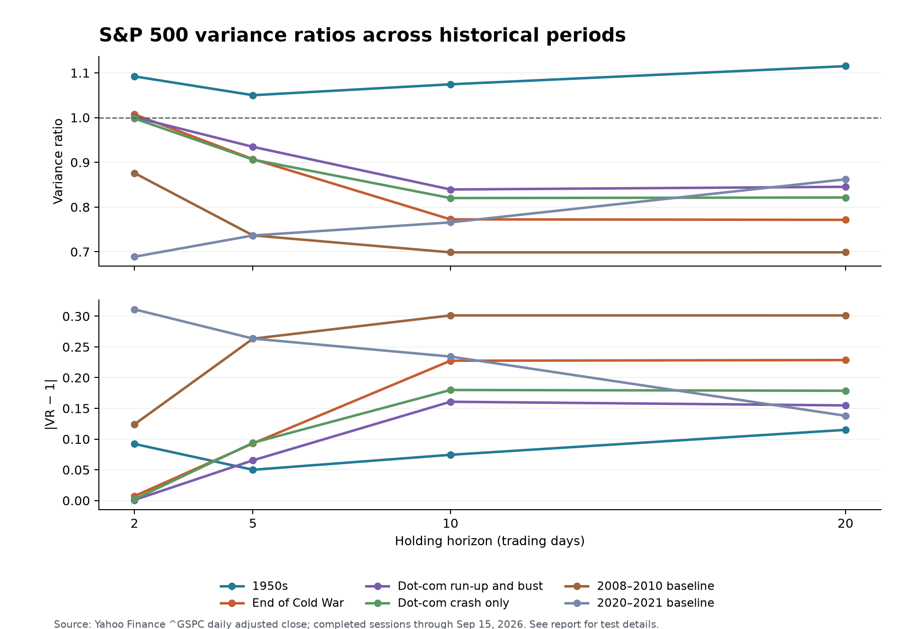

# Earlier US market variance ratio tests

This extends the original ^GSPC analysis using Yahoo Finance historical adjusted-close data. The expanded series begins January 3, 1950. The original and expanded series match to the cent on every overlapping completed trading session (4,706 observations through September 15, 2026). September 16, 2026 is omitted because its quote was still in progress in the extended download.

## Method

This uses the original run's Lo–MacKinlay variance ratio test: daily log price returns, a drift, overlapping q-day returns for q=2, 5, 10, 20 trading days, finite-sample debiasing, heteroskedasticity-robust inference, and two-sided p-values. The null is VR(q)=1. VR below 1 indicates negative aggregate serial correlation over that horizon; VR above 1 indicates positive serial correlation. The robust test uses large-sample normal inference, as in the [arch VarianceRatio documentation](https://arch.readthedocs.io/en/latest/unitroot/generated/arch.unitroot.VarianceRatio.html).

Holm p-values correct for four horizons within each period. A separate adjustment covers all 24 estimates across the six windows. Period windows are inclusive calendar dates; returns begin on the first trading session and end on the last session in each window. The period-specific mean absolute distance mean(|VR(q)-1|) is a descriptive summary; direct between-period comparisons appear below.

## Results

| Period | Daily returns | Mean abs(VR−1) | q=2 VR (Holm p) | q=5 VR (Holm p) | q=10 VR (Holm p) | q=20 VR (Holm p) | Reject any horizon after within-window Holm? |
|---|---:|---:|---:|---:|---:|---:|---|
| 1950s | 2,511 | 0.0829 | 1.0921 (0.0032) | 1.0500 (1.0000) | 1.0744 (1.0000) | 1.1150 (1.0000) | Yes: 2 days |
| End of Cold War | 758 | 0.1391 | 1.0072 (0.8709) | 0.9070 (0.7653) | 0.7725 (0.4012) | 0.7714 (0.7653) | No |
| Dot-com run-up and bust | 2,015 | 0.0955 | 1.0009 (0.9766) | 0.9346 (0.8664) | 0.8393 (0.4631) | 0.8452 (0.8664) | No |
| Dot-com crash only | 752 | 0.1136 | 0.9980 (0.9805) | 0.9061 (0.9805) | 0.8201 (0.8891) | 0.8213 (0.9805) | No |
| 2008–2010 baseline | 757 | 0.2475 | 0.8760 (0.0926) | 0.7366 (0.1379) | 0.6988 (0.3028) | 0.6988 (0.3370) | No |
| 2020–2021 baseline | 505 | 0.2367 | 0.6889 (0.0916) | 0.7365 (1.0000) | 0.7657 (1.0000) | 0.8621 (1.0000) | No |

Within-window adjusted p-values below 0.05 reject that horizon's random-walk restriction. For the 1950s, q=2 also survives Holm correction across all 24 tests (global adjusted p=0.0194); it is the only global rejection.

## How to read this as a test of historical inefficiency

A rejection says this series departs from the particular random-walk variance restriction at the chosen horizon, under this test and sample. It does not establish all forms of market inefficiency, nor does failure to reject prove efficiency. The data are a broad S&P 500 price index, not the full US equity market or a dividend-reinvested total-return portfolio.

1950–1959, 1988–1990, the full 1995–2002 dot-com run-up and bust, and the nested 2000–2002 crash window show the requested historical tests. The 2008–2010 and 2020–2021 periods repeat the original analysis as comparison baselines. The run-up-and-bust window spans more than twice as many years as the 2000–2002 window; their estimates do not isolate a causal bubble effect.

### Direct comparison with the 2008–2021 baseline windows

For each historical window, the table compares its mean absolute VR distance with the equally weighted average for 2008–2010 and 2020–2021 (0.2421). Negative differences mean the historical point estimate is closer to VR=1. The primary inference uses stationary bootstrap blocks averaging 40 trading days, 4,999 resamples per period, Holm correction over these four historical comparisons, and family-wise 95% intervals.

| Earlier window | Historical distance | Difference vs baseline average | Holm p | Family-wise 95% interval for difference |
|---|---:|---:|---:|---:|
| 1950s | 0.0829 | -0.1592 | 0.0728 | [-0.3276, 0.0092] |
| End of Cold War | 0.1391 | -0.1030 | 0.2140 | [-0.3100, 0.1040] |
| Dot-com run-up and bust | 0.0955 | -0.1466 | 0.0859 | [-0.3140, 0.0207] |
| Dot-com crash only | 0.1136 | -0.1285 | 0.1925 | [-0.3213, 0.0644] |

No historical-versus-baseline contrast is significant after Holm correction at the primary 40-day block length. Sensitivity checks using 20-day blocks also find no significant contrast; with 60-day blocks, only the 1950s comparison crosses 5% (Holm p=0.0484). Since that result depends on block length, the bootstrap evidence does not establish that any older window was less inefficient than the recent baseline. The point estimates are lower in all four windows, but they are not conclusive evidence of a difference.

This comparison is exploratory: it assumes weak dependence within each period and independent non-overlapping period samples. Structural breaks, market regime changes, and the block-length choice can affect the bootstrap inference.

## Validation and provenance

All 24 library VR, robust Z, and p-value estimates match an independent scalar implementation (rtol=1e-10, atol=1e-12); extended and original Yahoo adjusted closes match exactly on all overlapping completed sessions.
The raw extended response, exact source hash, cutoff, requested bounds, all full-precision test values, period roles, Holm adjustments, and bootstrap comparisons are recorded in `historical_variance_ratio_results.json`.

Sources: [Yahoo Finance S&P 500 (^GSPC) history](https://finance.yahoo.com/quote/%5EGSPC/history/); [arch VarianceRatio documentation](https://arch.readthedocs.io/en/latest/unitroot/generated/arch.unitroot.VarianceRatio.html). Reproduce with `.venv/bin/python analyze_historical_variance_ratio.py`; no network access is needed.
