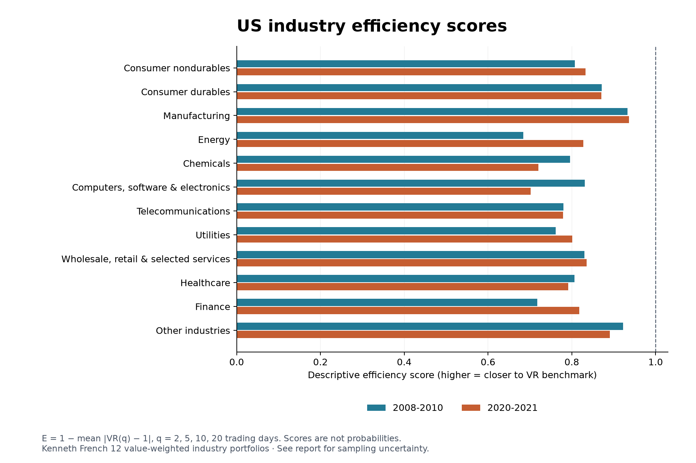

# US Market Standard Deviation by Sectors

## Definition and interpretation

This analysis uses all 12 Kenneth French broad industry portfolios as its primary panel and all 49 narrower industries as a descriptive supplement. They are SIC-based portfolios of US stocks, not the 11 GICS sectors. The two taxonomies are analyzed separately, never pooled.

Define D_i = (1/4) * sum over q in {2,5,10,20} of |VR_i(q) − 1|, and the efficiency score E_i = 1 − D_i. Higher E means closer to the random-walk variance restriction. E = 1 is the benchmark. This transparent, study-specific score gives equal weight to each horizon; it is not a standardized market-efficiency index, probability, or percentage. It can be negative; no clipping is applied. Opposite-signed VR deviations of equal size receive the same score. Averages can hide differences across horizons.

Cross-industry population SD = sqrt(sum_i (E_i − mean(E))² / K), where K=12 (or 49 in the supplement). All industries in each chosen classification are included. The alternative sample SD with denominator K−1 is also reported. Both SDs are calculated from full precision scores before rounding. SD(E) equals SD(D).

SD = 0 means identical estimated scores. Equal scores below 1 mean equal estimated average distances from the VR benchmark, not proof of equal inefficiency. Nonzero estimated SD may arise from estimation error even when population scores are identical. Neither result proves or disproves the full efficient-market hypothesis.

## Primary results: 12 industries

| Industry | E: 2008–2010 | E: 2020–2021 |
|---|---:|---:|
| Consumer nondurables (NoDur) | 0.807262 | 0.832331 |
| Consumer durables (Durbl) | 0.871579 | 0.870646 |
| Manufacturing (Manuf) | 0.933038 | 0.936356 |
| Energy (Enrgy) | 0.684565 | 0.827683 |
| Chemicals (Chems) | 0.796169 | 0.720201 |
| Computers, software & electronics (BusEq) | 0.831352 | 0.702131 |
| Telecommunications (Telcm) | 0.780165 | 0.778713 |
| Utilities (Utils) | 0.761886 | 0.800792 |
| Wholesale, retail & selected services (Shops) | 0.829750 | 0.835516 |
| Healthcare (Hlth) | 0.806437 | 0.791866 |
| Finance (Money) | 0.717396 | 0.817775 |
| Other industries (Other) | 0.922581 | 0.890665 |
| **Mean score** | **0.811848** | **0.817056** |
| **Population SD (K denominator)** | **0.070791** | **0.063356** |
| **Sample SD (K−1 denominator)** | **0.073938** | **0.066173** |

The population SD is nonzero in both periods: the estimated industry scores are not identical. Comparing these two SD point estimates is descriptive; no formal test of a change in dispersion between periods is claimed.

## Sampling uncertainty and equality

To avoid treating nonzero estimated SD as a significant difference, stationary block bootstrap draws resample the whole daily industry-return vector. This retains contemporaneous cross-industry dependence and dependence within sampled blocks. The primary mean block length is 40 trading days with 4,999 replicates; 20 and 60 days with 2,499 replicates each are sensitivity checks. All random seeds are saved.

For each period, the maximum absolute standardized bootstrap VR estimation error across 12 industries × 4 horizons determines joint 97.5% bands for the signed VR parameters. Bootstrap standard deviations supply the fixed scales; the bootstrap errors are centered at the original estimates. Bonferroni across the two periods targets approximate 95% simultaneous coverage. Bounds are intersected with the nonnegative VR parameter space. The bands are then propagated through the absolute-distance score. This handles the nondifferentiability at VR=1 without directly bootstrapping the absolute-value score for inference.

The minimum possible population SD within the score bounds is zero if the score intervals share a common point; otherwise it is computed by convex minimization. The maximum is obtained over all 2^12 interval corners. These propagated bounds are conservative. Equality is excluded only if there is no score common to all industry intervals. A naive percentile interval for a nonnegative SD is not used to test zero.

| Period | Estimated population SD | Propagated SD bounds | Equal scores excluded? |
|---|---:|---|---|
| 2008-2010 | 0.070791 | [0.000000, 0.323272] | No |
| 2020-2021 | 0.063356 | [0.000000, 0.360912] | No |

These are approximate bootstrap bounds under weak-dependence and stationarity assumptions, not exact finite-sample confidence guarantees. Crisis windows mix volatile regimes; small samples, block choice, and the conservativeness of band propagation limit inference. Failure to exclude equality is not evidence that equality is true. Individual robust VR tests and their multiple-testing adjustments are recorded separately in JSON; their p-values are not efficiency scores.

### Block-length sensitivity

| Period | Mean block length | Propagated SD bounds | Equal scores excluded? |
|---|---:|---|---|
| 2008-2010 | 40 | [0.000000, 0.323272] | No |
| 2008-2010 | 20 | [0.000000, 0.331859] | No |
| 2008-2010 | 60 | [0.000000, 0.321563] | No |
| 2020-2021 | 40 | [0.000000, 0.360912] | No |
| 2020-2021 | 20 | [0.000000, 0.369217] | No |
| 2020-2021 | 60 | [0.000000, 0.352310] | No |

## Supplement: all 49 industries

The following is descriptive; the bootstrap equality analysis above applies to the 12-industry primary panel only. Codes follow the [49-industry definitions](https://mba.tuck.dartmouth.edu/pages/faculty/ken.french/Data_Library/det_49_ind_port.html).

| Industry code | E: 2008–2010 | E: 2020–2021 |
|---|---:|---:|
| Agric | 0.810295 | 0.769035 |
| Food | 0.749150 | 0.735950 |
| Soda | 0.862178 | 0.954497 |
| Beer | 0.805670 | 0.709793 |
| Smoke | 0.804277 | 0.843541 |
| Toys | 0.977854 | 0.765019 |
| Fun | 0.826289 | 0.913675 |
| Books | 0.974512 | 0.898600 |
| Hshld | 0.783126 | 0.646888 |
| Clths | 0.944057 | 0.954552 |
| Hlth | 0.950052 | 0.902894 |
| MedEq | 0.965495 | 0.925820 |
| Drugs | 0.767494 | 0.729945 |
| Chems | 0.896150 | 0.871795 |
| Rubbr | 0.902248 | 0.886073 |
| Txtls | 0.667040 | 0.944391 |
| BldMt | 0.931623 | 0.935430 |
| Cnstr | 0.830858 | 0.848767 |
| Steel | 0.943819 | 0.932560 |
| FabPr | 0.933525 | 0.920897 |
| Mach | 0.930308 | 0.831043 |
| ElcEq | 0.839288 | 0.894927 |
| Autos | 0.865573 | 0.875989 |
| Aero | 0.951025 | 0.792618 |
| Ships | 0.819912 | 0.946601 |
| Guns | 0.886316 | 0.817943 |
| Gold | 0.819518 | 0.891508 |
| Mines | 0.918139 | 0.912603 |
| Coal | 0.839383 | 0.937005 |
| Oil | 0.677915 | 0.825861 |
| Util | 0.761886 | 0.800792 |
| Telcm | 0.780165 | 0.778713 |
| PerSv | 0.890595 | 0.912396 |
| BusSv | 0.911069 | 0.859203 |
| Hardw | 0.889756 | 0.813051 |
| Softw | 0.779637 | 0.730680 |
| Chips | 0.839464 | 0.680649 |
| LabEq | 0.909602 | 0.781903 |
| Paper | 0.902865 | 0.737447 |
| Boxes | 0.939271 | 0.813711 |
| Trans | 0.861742 | 0.921499 |
| Whlsl | 0.917513 | 0.909639 |
| Rtail | 0.821625 | 0.814711 |
| Meals | 0.825931 | 0.926276 |
| Banks | 0.710172 | 0.809771 |
| Insur | 0.831935 | 0.843962 |
| RlEst | 0.916396 | 0.873460 |
| Fin | 0.722095 | 0.812509 |
| Other | 0.942846 | 0.837673 |
| **Mean score** | **0.857707** | **0.846414** |
| **Population SD** | **0.078106** | **0.077268** |
| **Sample SD** | **0.078916** | **0.078068** |

## Data, method, and validation

Value-weighted daily industry returns come from the frozen July 2026 CRSP vintage in the Kenneth French library. Each industry has 757 returns for 2008–2010 and 505 for 2020–2021. Raw percentage simple returns are transformed with log(1+R/100); log wealth starts at zero and accumulates these returns. The industry analysis uses total returns and is not directly interchangeable with the earlier S&P 500 price-index analysis.

Lo–MacKinlay variance ratios use nonzero drift, overlapping returns, finite-sample debiasing, and heteroskedasticity-robust normal inference. Robust p-values are Holm-adjusted within each period across all industries/horizons, and additionally across both periods; the 12- and 49-industry analyses have separate testing families (96 and 392 tests).

All 488 observed VR estimates match arch.unitroot.VarianceRatio, and every robust Z and p-value is checked against the independent scalar implementation. Validation also covers symmetric distances around VR=1, zero dispersion for identical scores, and known minimum/maximum dispersion bounds. Full precision estimates, source hashes, individual tests, and bootstrap settings are in industry_efficiency_results.json.

Reproduce with `.venv/bin/python analyze_industry_efficiency.py` from the project root after installing the saved requirements. No network requests are made.

Sources: [12-industry construction](https://mba.tuck.dartmouth.edu/pages/faculty/ken.french/Data_Library/det_12_ind_port.html); [49-industry construction](https://mba.tuck.dartmouth.edu/pages/faculty/ken.french/Data_Library/det_49_ind_port.html); [variance-ratio implementation](https://arch.readthedocs.io/en/latest/unitroot/generated/arch.unitroot.VarianceRatio.html); [stationary bootstrap implementation](https://arch.readthedocs.io/en/latest/bootstrap/generated/arch.bootstrap.StationaryBootstrap.html); [Politis and Romano (1994)](https://doi.org/10.1080/01621459.1994.10476870). The particular four-horizon score and propagation of joint bands are choices documented for this study.
