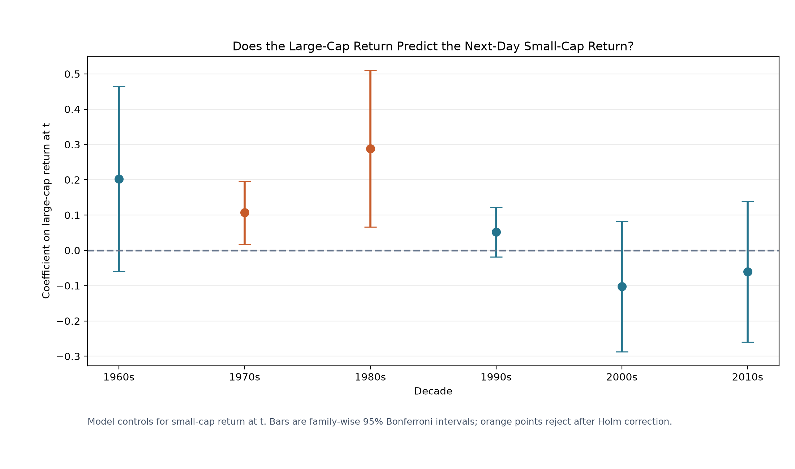

# Do Large-Cap Stocks Lead Small-Cap Stocks?

## Method

For each decade, the test estimates the daily predictive regression `small(t+1) = intercept + phi*small(t) + beta*large(t) + error(t+1)`. Controlling for `small(t)` asks whether the large-cap return adds information beyond the small-cap portfolio's own one-day persistence.

The coefficient uses log total returns. A beta of 0.10 means that a 1% large-cap return today predicts about an additional 0.10% small-cap return on the next trading day, conditional on today's small-cap return. Inference uses Newey-West HAC standard errors with five lags, two-sided tests, and Holm adjustment across the six decades.

## Results

| Decade | Beta on large(t) | HAC SE | Family-wise 95% interval | Holm p | Incremental R² | Evidence large leads small? |
|---|---:|---:|---:|---:|---:|---|
| 1960s | +0.2021 | 0.0993 | [-0.0598, +0.4640] | 0.1672 | 0.9701% | No |
| 1970s | +0.1070 | 0.0339 | [+0.0175, +0.1965] | 0.0080 | 0.4100% | Yes |
| 1980s | +0.2880 | 0.0841 | [+0.0659, +0.5100] | 0.0037 | 6.8433% | Yes |
| 1990s | +0.0521 | 0.0267 | [-0.0182, +0.1224] | 0.1672 | 0.1935% | No |
| 2000s | -0.1022 | 0.0702 | [-0.2873, +0.0830] | 0.2910 | 0.2399% | No |
| 2010s | -0.0600 | 0.0756 | [-0.2593, +0.1393] | 0.4272 | 0.0475% | No |

## Interpretation

After controlling for the small-cap portfolio's own lag and correcting for six decade tests, large-cap returns have positive next-day predictive content for small-cap returns in the 1970s and 1980s. The other decades do not reject a zero incremental effect at the 5% family-wise level.

The 1970s coefficient is smaller but precisely estimated. The 1980s effect is both larger and more economically meaningful by incremental R². This matches the earlier variance-ratio evidence that older small-cap returns contained substantial positive serial dependence.

As a direction check, the reverse regressions test whether small-cap(t) predicts large-cap(t+1), controlling for large-cap(t). No reverse test is significant after Holm correction. That asymmetry supports a large-to-small lead in the 1970s and 1980s, although it does not establish economic causality.

Statistical predictability is not automatically a profitable strategy: the test does not subtract trading costs, and older small-stock prices were more exposed to infrequent trading and stale-price effects.

## Reverse-direction diagnostic

| Decade | Beta on small(t) | Holm p | Significant after correction? |
|---|---:|---:|---|
| 1960s | -0.0244 | 1.0000 | No |
| 1970s | -0.0682 | 0.3500 | No |
| 1980s | -0.2108 | 0.0853 | No |
| 1990s | -0.0284 | 1.0000 | No |
| 2000s | +0.0212 | 1.0000 | No |
| 2010s | -0.0013 | 1.0000 | No |

## Data and validation

The portfolios are the Kenneth French value-weighted bottom 30% and top 30% size portfolios. They use NYSE size breakpoints and include eligible NYSE, AMEX, and Nasdaq stocks.

Every regression coefficient and HAC covariance matrix matches an independent matrix implementation. Full-precision results, dates, model settings, and the source hash are stored in `large_to_small_lead_lag.json`.

Reproduce with `.venv/bin/python analyze_large_leads_small.py`; no network request is needed.
