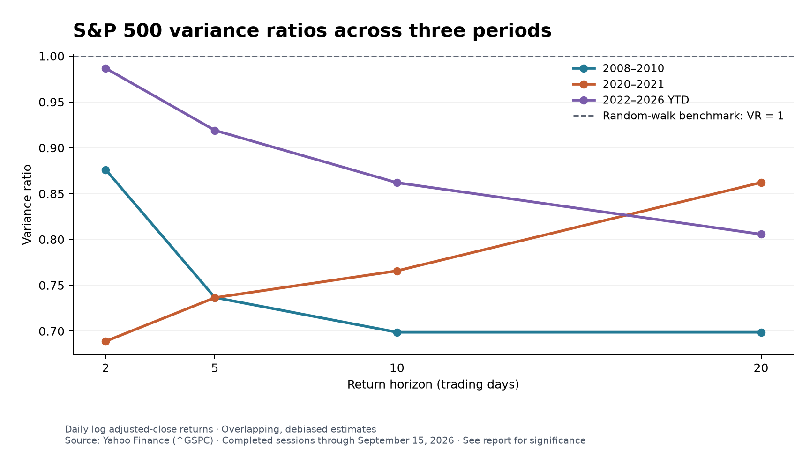

# S&P 500 variance ratio analysis

**Finding:** None of the tested horizons rejects the random-walk variance restriction at 5% after Holm adjustment within each period. Before adjustment, the 2008–2010 period rejects at 2 and 5 days, and 2020–2021 rejects at 2 days; 2022–2026 does not reject at any tested horizon.

Source: [Yahoo Finance S&P 500 (^GSPC) history](https://finance.yahoo.com/quote/%5EGSPC/history/). Retrieved September 16, 2026. The final included session is September 15, 2026; September 16's incomplete session is excluded.

## Sample definition

The S&P 500 is a proxy for large-cap US stocks, not the entire US equity universe. This is a price-index analysis, not a dividends-reinvested total-return analysis. Yahoo adjusted close is used; its equality with close is checked and recorded in the JSON results. User-specified years are inclusive. The crisis and COVID windows include recovery periods and are not event-only windows.

| Period | First return | Last return | Daily returns | Base close |
|---|---|---|---:|---|
| 2008–2010 | 2008-01-02 | 2010-12-31 | 757 | 2007-12-31 |
| 2020–2021 | 2020-01-02 | 2021-12-31 | 505 | 2019-12-31 |
| 2022–2026 YTD | 2022-01-03 | 2026-09-15 | 1,179 | 2021-12-31 |

The previous trading session's close is included solely to compute the first return in each period. Every tested daily return ends within its assigned window; no missing prices are forward-filled and no returns are formed across the gaps between study windows.

## Method

Let r_t = ln(P_t/P_(t−1)). The null is VR(q) = 1, consistent with uncorrelated returns and linear growth of return variance with horizon. The alternatives are two-sided. Horizons q = 2, 5, 10 and 20 are trading days, roughly two days, one week, two weeks and one month.

Tests allow a nonzero drift, use overlapping q-day returns, and debias the variance estimates. Heteroskedasticity-robust asymptotic Z statistics are used because financial volatility varies over time. See the [arch VarianceRatio documentation](https://arch.readthedocs.io/en/latest/unitroot/generated/arch.unitroot.VarianceRatio.html).

With T daily returns, mu = mean(r), S = sum((r−mu)^2), the one-day variance is S/(T−1). The q-day variance per day is sum((log(P_t/P_(t−q))−q*mu)^2) / [q*(T−q+1)*(1−q/T)]. Their ratio is VR(q). Define delta_j = sum((r_t−mu)^2*(r_(t−j)−mu)^2)/S^2 and theta = sum([2*(q−j)/q]^2*delta_j), for j = 1,...,q−1. Then Z = (VR−1)/sqrt(theta), with a two-sided standard-normal p-value.

Holm-adjusted p-values control family-wise error over four horizons within each period. The JSON additionally reports adjustment over all 12 tests. Unadjusted results are shown transparently; this is not a Chow–Denning test.

## Results

| Period | q | VR | Robust Z | Raw p | Holm p (4 horizons) | Reject at 5% after Holm? |
|---|---:|---:|---:|---:|---:|---|
| 2008–2010 | 2 | 0.8760 | -2.2708 | 0.0232 | 0.0926 | No |
| 2008–2010 | 5 | 0.7366 | -1.9957 | 0.0460 | 0.1379 | No |
| 2008–2010 | 10 | 0.6988 | -1.4347 | 0.1514 | 0.3028 | No |
| 2008–2010 | 20 | 0.6988 | -0.9601 | 0.3370 | 0.3370 | No |
| 2020–2021 | 2 | 0.6889 | -2.2752 | 0.0229 | 0.0916 | No |
| 2020–2021 | 5 | 0.7365 | -0.8862 | 0.3755 | 1.0000 | No |
| 2020–2021 | 10 | 0.7657 | -0.5418 | 0.5880 | 1.0000 | No |
| 2020–2021 | 20 | 0.8621 | -0.2353 | 0.8139 | 1.0000 | No |
| 2022–2026 YTD | 2 | 0.9867 | -0.2875 | 0.7737 | 1.0000 | No |
| 2022–2026 YTD | 5 | 0.9190 | -0.8369 | 0.4027 | 1.0000 | No |
| 2022–2026 YTD | 10 | 0.8619 | -0.9260 | 0.3545 | 1.0000 | No |
| 2022–2026 YTD | 20 | 0.8056 | -0.9364 | 0.3490 | 1.0000 | No |

## Interpretation

- **2008–2010:** raw 5% rejection horizons: [2, 5]; Holm-adjusted 5% rejection horizons: none.
- **2020–2021:** raw 5% rejection horizons: [2]; Holm-adjusted 5% rejection horizons: none.
- **2022–2026 YTD:** raw 5% rejection horizons: none; Holm-adjusted 5% rejection horizons: none.

VR below 1 indicates a negative aggregate serial-correlation pattern over the tested horizon; VR above 1 indicates a positive pattern. This alone does not establish statistical significance. Failure to reject is not proof of a random walk or market efficiency. A significant result does not by itself establish a profitable trading strategy or stationary price mean reversion.

These are separate within-period tests, not a formal test that periods differ from each other. Unequal sample lengths affect precision. Broad windows mix changing regimes, and asymptotic inference may be less accurate with heavy tails or structural breaks. The 2022–2026 sample covers only 2026 through the stated cutoff; no future prices are estimated. The analysis does not identify a causal crisis effect.

## Reproducibility and validation

All 12 VR, Z and p-value triples match an independent scalar implementation to rtol=1e-10, atol=1e-12.

The source snapshot, exact selected observations, full-precision estimates, sample boundaries, raw-data SHA-256 hash, and exclusions are retained. Date uniqueness, order, positive finite prices, and missing values are checked. Homoskedastic p-values in the JSON are a sensitivity diagnostic only and do not determine the conclusions.

Re-run `python analyze_variance_ratio.py` after installing `requirements.txt`. This uses the frozen snapshot and cutoff rather than silently fetching newer data.
