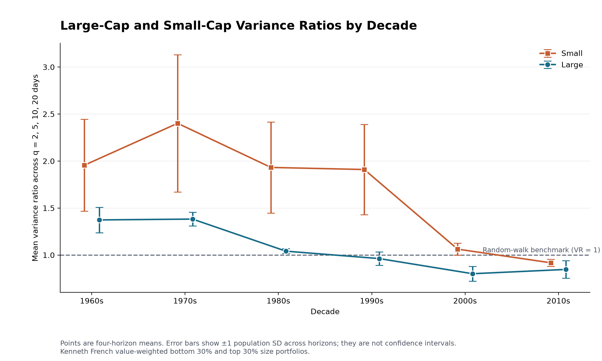

# Large-Cap versus Small-Cap Variance Ratios by Decade

## Definitions and method

Small-cap is the value-weighted bottom 30% portfolio and large-cap is the value-weighted top 30% portfolio from the Kenneth French Portfolios Formed on Size dataset. The size cutoffs use NYSE market-equity breakpoints; eligible NYSE, AMEX, and Nasdaq stocks are assigned to portfolios formed at the end of each June. These are research portfolios, not fixed constituent indexes.

Daily percentage total returns are converted to log returns. Each decade uses the same Lo–MacKinlay specification as the earlier S&P 500 analysis: q = 2, 5, 10, and 20 trading days, a drift, overlapping returns, finite-sample debiasing, and heteroskedasticity-robust inference.

The closeness score is E = 1 − mean(|VR(q)−1|). Higher values mean the four estimates are closer to the random-walk variance-scaling restriction. The score is not a percentage or a complete test of market efficiency.

## Direct comparison

The difference is large-cap score minus small-cap score. Positive values favor large-cap. The interval is a family-wise 95% simultaneous interval across the six decades from the paired 40-day stationary-block bootstrap; Holm p-values also adjust across the six comparisons.

| Decade | Small score | Large score | Large − small | Closer point estimate | Family-wise 95% interval | Holm p |
|---|---:|---:|---:|---|---:|---:|
| 1960s | 0.0445 | 0.6263 | +0.5818 | Large | [0.3647, 0.7989] | <0.0001 |
| 1970s | -0.4012 | 0.6175 | +1.0187 | Large | [0.7065, 1.3310] | <0.0001 |
| 1980s | 0.0680 | 0.9586 | +0.8906 | Large | [0.5799, 1.2012] | <0.0001 |
| 1990s | 0.0902 | 0.9295 | +0.8393 | Large | [0.4520, 1.2266] | <0.0001 |
| 2000s | 0.9335 | 0.8014 | -0.1321 | Small | [-0.3760, 0.1118] | 0.1529 |
| 2010s | 0.9173 | 0.8470 | -0.0703 | Small | [-0.1632, 0.0225] | 0.0915 |

## Variance ratios and dispersion

SD(VR) is the population standard deviation across the four horizon-specific ratios. Annualized volatility is the daily log-return sample standard deviation multiplied by sqrt(252).

| Decade | Portfolio | VR(2) | VR(5) | VR(10) | VR(20) | SD(VR) | Mean abs(VR−1) | Annualized volatility |
|---|---|---:|---:|---:|---:|---:|---:|---:|
| 1960s | Small | 1.3282 | 1.7101 | 2.1429 | 2.6406 | 0.4895 | 0.9555 | 11.49% |
| 1960s | Large | 1.1790 | 1.3234 | 1.4593 | 1.5330 | 0.1352 | 0.3737 | 9.90% |
| 1970s | Small | 1.4518 | 2.0559 | 2.6774 | 3.4199 | 0.7305 | 1.4012 | 13.40% |
| 1970s | Large | 1.2603 | 1.4290 | 1.3991 | 1.4416 | 0.0722 | 0.3825 | 13.58% |
| 1980s | Small | 1.2993 | 1.6871 | 2.1551 | 2.5864 | 0.4843 | 0.9320 | 12.49% |
| 1980s | Large | 1.0762 | 1.0360 | 1.0503 | 1.0032 | 0.0263 | 0.0414 | 16.84% |
| 1990s | Small | 1.2785 | 1.6947 | 2.0922 | 2.5740 | 0.4794 | 0.9098 | 11.42% |
| 1990s | Large | 1.0436 | 1.0221 | 0.9089 | 0.8747 | 0.0719 | 0.0705 | 13.91% |
| 2000s | Small | 0.9930 | 1.0286 | 1.0654 | 1.1650 | 0.0642 | 0.0665 | 24.48% |
| 2000s | Large | 0.9258 | 0.8107 | 0.7398 | 0.7292 | 0.0784 | 0.1986 | 22.08% |
| 2010s | Small | 0.9589 | 0.9519 | 0.8911 | 0.8673 | 0.0391 | 0.0827 | 20.00% |
| 2010s | Large | 0.9570 | 0.9110 | 0.7965 | 0.7235 | 0.0922 | 0.1530 | 14.81% |

## Answer to the large-versus-small question

Large-cap is closer to VR=1 by point estimate in 1960s, 1970s, 1980s, 1990s. Small-cap is closer in 2000s, 2010s.

After the paired bootstrap and Holm adjustment, statistically detectable size differences occur in 1960s, 1970s, 1980s, 1990s.

The ranking can change because VR values above and below 1 both count as departures; a lower raw VR is not automatically more or less random. Compare the absolute distance from 1 or the closeness score.

The very high older small-cap ratios indicate strong positive aggregate serial correlation in the portfolio returns. Nonsynchronous trading and stale prices can contribute to this pattern in less-liquid small stocks, so it should not automatically be interpreted as an exploitable trading opportunity.

The 20-day and 60-day block-length sensitivity results are stored in the JSON. A result that changes under those alternatives should be treated cautiously.

## Data and validation

All 48 variance ratios, robust Z statistics, and p-values match an independent scalar implementation (rtol=1e-10, atol=1e-12).
The full-precision results, individual tests, multiple-testing adjustments, bootstrap settings, sensitivity checks, and source hash are in `size_decade_variance_ratios.json`.

Source: [Kenneth French, Portfolios Formed on Size](https://mba.tuck.dartmouth.edu/pages/faculty/ken.french/Data_Library/det_port_form_sz.html). Reproduce with `.venv/bin/python analyze_size_decades.py`; the saved source archive means no network request is needed.
