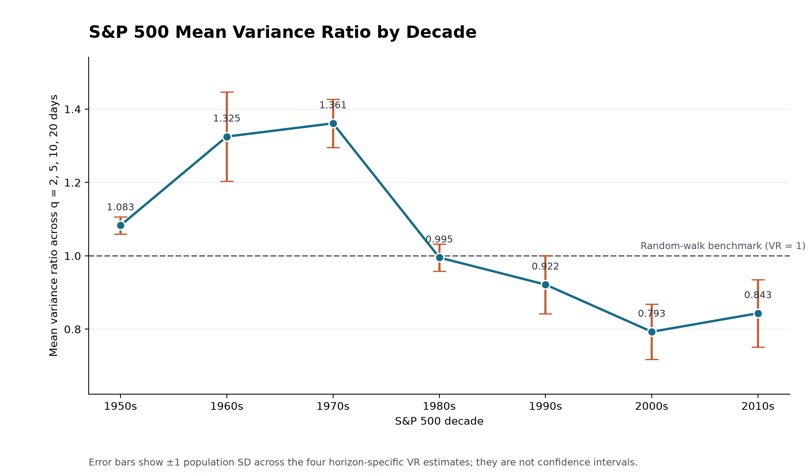

# S&P 500 Variance Ratios by Decade

## Method

This analysis uses daily S&P 500 adjusted-close log returns and the same Lo–MacKinlay variance-ratio specification as the earlier historical run: a drift, overlapping returns, finite-sample debiasing, and heteroskedasticity-robust inference. Each decade is a separate full calendar window. The tested horizons are 2, 5, 10, and 20 trading days.

`SD(VR)` is the population standard deviation across the four variance-ratio point estimates within that decade. It shows how much the estimates vary by horizon; it is not a standard error. `Return volatility` is the sample standard deviation of daily log returns annualized with sqrt(252). Mean absolute distance is mean(|VR−1|), so lower values are closer to the random-walk variance restriction.

## Results

| Decade | Daily returns | VR(2) | VR(5) | VR(10) | VR(20) | SD(VR) | Mean abs(VR−1) | Annualized return volatility |
|---|---:|---:|---:|---:|---:|---:|---:|---:|
| 1950s | 2,511 | 1.0921 | 1.0500 | 1.0744 | 1.1150 | 0.0238 | 0.0829 | 11.48% |
| 1960s | 2,489 | 1.1540 | 1.2731 | 1.3993 | 1.4739 | 0.1221 | 0.3251 | 10.19% |
| 1970s | 2,526 | 1.2504 | 1.4065 | 1.3723 | 1.4155 | 0.0660 | 0.3612 | 13.59% |
| 1980s | 2,528 | 1.0517 | 0.9875 | 0.9941 | 0.9479 | 0.0370 | 0.0305 | 17.44% |
| 1990s | 2,528 | 1.0173 | 0.9797 | 0.8612 | 0.8280 | 0.0790 | 0.0871 | 14.11% |
| 2000s | 2,515 | 0.9143 | 0.7980 | 0.7326 | 0.7266 | 0.0755 | 0.2071 | 22.23% |
| 2010s | 2,516 | 0.9542 | 0.9060 | 0.7934 | 0.7201 | 0.0921 | 0.1566 | 14.80% |

## Statistical tests

A variance ratio of 1 is the random-walk variance-scaling restriction. The table below gives Holm-adjusted p-values within each decade; an adjusted p-value below 0.05 rejects that restriction at that horizon.

| Decade | q=2 VR (Holm p) | q=5 VR (Holm p) | q=10 VR (Holm p) | q=20 VR (Holm p) | Rejected horizons |
|---|---:|---:|---:|---:|---|
| 1950s | 1.0921 (0.0032) | 1.0500 (1.0000) | 1.0744 (1.0000) | 1.1150 (1.0000) | 2 |
| 1960s | 1.1540 (0.0038) | 1.2731 (0.0051) | 1.3993 (0.0048) | 1.4739 (0.0051) | 2, 5, 10, 20 |
| 1970s | 1.2504 (0.0000) | 1.4065 (0.0000) | 1.3723 (0.0001) | 1.4155 (0.0018) | 2, 5, 10, 20 |
| 1980s | 1.0517 (1.0000) | 0.9875 (1.0000) | 0.9941 (1.0000) | 0.9479 (1.0000) | None |
| 1990s | 1.0173 (1.0000) | 0.9797 (1.0000) | 0.8612 (0.6007) | 0.8280 (0.6166) | None |
| 2000s | 0.9143 (0.0451) | 0.7980 (0.0451) | 0.7326 (0.0727) | 0.7266 (0.1501) | 2, 5 |
| 2010s | 0.9542 (0.3091) | 0.9060 (0.3091) | 0.7934 (0.2387) | 0.7201 (0.2387) | None |

## Interpretation

The 1980s are closest to VR=1 on the four-horizon summary (mean absolute distance 0.0305), while the 1970s are farthest (0.3612). The 1950s have the smallest horizon-to-horizon spread in VR estimates (SD 0.0238). The 2000s have the highest annualized daily-return volatility (22.23%).

The population standard deviation of the seven decade closeness scores is 0.1168. This describes variation among the decade point estimates; it is not a confidence interval or a test that the decades have different true efficiencies.

Across the seven decades, the population SD of the VR point estimates is 2-day: 0.1072, 5-day: 0.1963, 10-day: 0.2478, 20-day: 0.2899. Dispersion across decades rises with the holding horizon in these estimates.

The SD across four variance-ratio estimates describes horizon-to-horizon dispersion and is not a sampling standard error or a formal efficiency test. A variance-ratio rejection tests one random-walk implication; it does not by itself prove or disprove market efficiency.

## Data and validation

Every library variance ratio, robust Z statistic, and p-value matches the project's independent scalar implementation (rtol=1e-10, atol=1e-12).
The full-precision estimates, p-values, source hash, observation dates, and both population and sample standard deviations are in `sp500_decade_variance_ratios.json`.

Source: [Yahoo Finance S&P 500 (^GSPC) history](https://finance.yahoo.com/quote/%5EGSPC/history/). Reproduce with `.venv/bin/python analyze_sp500_decades.py`; no network access is needed.
